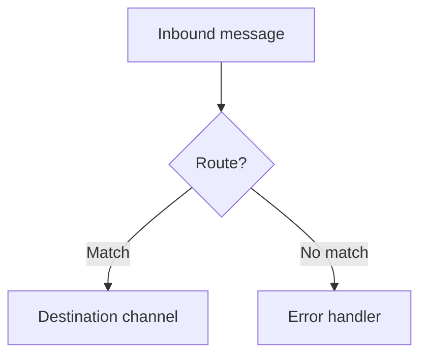

# CLAUDE_USER_EXAMPLE.md — starter for your OIE channel & template code

**This is a template, not a rule for this repo.** It is a starter `CLAUDE.md` for a *separate* repository —
**yours** — that holds the JavaScript you deploy into **Open Integration Engine** channels: source/
destination transformers, filters, response transformers, attachment handlers, and Global / Code Template
scripts. Copy it to *your* repo's root as `CLAUDE.md` and fill in the `TODO` sections.

> Working on the **OIE engine itself** (the Java in this repository)? That's a different job — see this
> repo's [`CLAUDE.md`](./CLAUDE.md), not this file.

OIE executes channel/template JavaScript on the **Rhino** engine (bundled with the Java 17 runtime), so the
constraints below are about Rhino's partial ES6 support and Java interop — not about Node.js. Real, working
examples of channels and code templates live in
**[`OpenIntegrationEngine/oie-examples`](https://github.com/OpenIntegrationEngine/oie-examples)**; project
docs are at **[openintegrationengine.org](https://openintegrationengine.org)** and the community is on
**[Discord](https://discord.gg/azdehW2Zrx)**.

Everything from **"Technical Constraints"** down is generic to OIE's Rhino runtime and should apply
unchanged; the `TODO` sections above it are where your project's specifics go.

---

## Project Overview
> **TODO:** One paragraph — what your integration does, which upstream/downstream systems it connects, and
> the primary message types (HL7 v2, FHIR, X12, DICOM, custom JSON, …).

## Commands
> **TODO:** Your project's scripts. A channel/template repo commonly has lint + a way to export/import
> channels; fill in what you actually use.
```bash
npm run eslint      # lint the deployed JS
npm test            # unit tests over pure logic (with mocked OIE globals)
# ...your channel export/import / deploy commands
```

## Architecture
> **TODO:** Your message flow and key channels/code-template libraries. A Mermaid diagram helps (see
> "Documentation standards").

## Source structure
> **TODO:** Outline your repo layout so the assistant knows where deployed code vs. build tooling lives.

---

## Technical Constraints

**OIE JavaScript engine.** OIE runs channel/template JavaScript on **Rhino**, which has only **partial ES6
support**. The rules in this section apply to every source file deployed into a channel (transformers,
filters, response transformers, attachment handlers, and Global/Code Template scripts).

> Files that run in a normal Node.js context (build tooling, tests, non-OIE utilities) are **not** subject
> to these rules — scope this section to the directory that gets deployed to OIE (commonly `src/`).

### Supported ES6 features (safe to use)
- `const` and `let` — prefer over `var`. `const` by default, `let` when reassignment is needed (but see the
  Rhino loop-scoping bug below).
- Arrow functions `() => {}` — fine in callbacks, `.map()`, `.filter()`, etc.
- Object/array destructuring — `const { a, b } = options`
- `Object.keys()`, `Object.values()`, `Object.entries()`, `Object.assign()`
- Array methods: `.map()`, `.filter()`, `.reduce()`, `.forEach()`, `.find()`, `.some()`, `.every()`

### Prohibited ES6+ features (will break at runtime in OIE)
- **Template literals** — NEVER use backtick strings. `` `Hello ${name}` `` fails at runtime. Use string
  concatenation or `Array.join()` (see "String building").
- **Optional chaining `?.`** — not supported; use a try/catch helper (see "Safe property access").
- **Nullish coalescing `??`** — use `||` or an explicit ternary.
- **`async`/`await`** — not supported. Transformers are synchronous; use callbacks/retries.
- **`Promise`** — not available in the runtime.
- **ES6 classes (`class`/`extends`)** — use constructor functions with `.prototype` methods.
- **ES6 modules (`import`/`export`)** — share code via Code Templates plus `/* global */` and
  `/* exported */` comments (see "Module/export pattern").
- **Spread syntax `...args`** — minimal/unreliable support; avoid, especially in parameter lists.
- **`for...of` loops** — use `.forEach()` or a traditional indexed `for` loop.
- **Default parameters** — use `param = param || defaultValue` instead.

> **Version-dependent — verify on your server.** `Symbol`, `Map`, and `Set` exist on current OIE/Rhino
> builds but were missing on older Mirth ones. Different releases ship different Rhino versions (and some
> setups can be configured for other engines), so confirm any borderline feature against what your server
> actually runs. When in doubt, prefer the ES5-safe form.

### Rhino loop-scoping bug — use `let` inside loop bodies, never `const`
Rhino hoists a `const`/`let` declared **inside** a loop body to the enclosing function scope instead of
re-creating it per iteration. With `const`, the binding is created once and silently reused — mutations
don't error, but the variable doesn't behave per spec.

```javascript
// WRONG — Rhino reuses the same binding across iterations.
while ((result = regex.exec(str)) !== null) {
  const replacer = String(values[result[1]] || '').padEnd(result[0].length);
  newStr = newStr.replace(result[0], replacer);
}

// CORRECT — use `let` so the per-iteration assignment actually takes effect.
while ((result = regex.exec(str)) !== null) {
  // MUST USE LET — Rhino hoists a const declared inside a loop to the outer scope.
  let replacer = String(values[result[1]] || '').padEnd(result[0].length);
  newStr = newStr.replace(result[0], replacer);
}
```
Applies to `for`, `for...in`, `while`, and `do/while` bodies. Declarations **outside** the loop are
unaffected — `const` is still preferred at function scope.

### Java interop returns Java objects, not JS values
OIE APIs and `java.*` / `Packages.*` calls return **Java** objects, which don't behave like their JS
lookalikes:
- A Java `List`'s `.toArray()` returns a Java `Object[]`, **not** a JS array. `Array.isArray()` is `false`
  for it and it has no `.push()`. Copy element-by-element into a real JS array first:
  ```javascript
  function toJsArray(v) {
    if (v == null) return [];
    if (Array.isArray(v)) return v;
    const src = v.toArray ? v.toArray() : v;          // Java List -> Java Object[]
    if (src != null && typeof src.length === 'number' && typeof src !== 'string') {
      const out = [];
      for (let i = 0; i < src.length; i++) {
        let ele = src[i]; // MUST USE LET (loop-scoping bug)
        out.push(ele);
      }
      return out;
    }
    return [v];
  }
  ```
- Java strings are `java.lang.String`, not JS strings — wrap with `String(x)` before string ops or identity
  comparisons.
- Java numbers (`BigInteger`, `Long`, …) may need `Number(x)` / `String(x)` normalization.

### Legacy `var` usage
Older channel code often uses `var`. When editing such a file you may modernize `var` → `const`/`let` where
it's clearly safe, but don't refactor a whole file just to change declarations.

## Global scope execution
All OIE scripts run in a **global scope** with engine-provided globals; there is no runtime module system —
code is shared via Code Templates. Commonly available:
- **Message data:** `msg`, `tmp` (transformers), `message`, `connectorMessage`
- **Maps:** `channelMap`, `connectorMap`, `responseMap`, `globalMap`, `globalChannelMap`,
  `configurationMap`, `sourceMap`
- **Map accessor shorthands** (built-in): `$c(k[, v])` → `channelMap`, `$gc(k[, v])` → `globalChannelMap`,
  `$g(k[, v])` → `globalMap`, `$s(k[, v])` → `sourceMap`, `$cfg(k)` → `configurationMap`. One arg gets, two
  args sets.
- **Channel context:** `channelId`, `channelName`, `messageId`, `logger`, `router`, `destinationSet`,
  `response`, `replacer`
- **Batch scripts:** `reader` (and `writer` where applicable)
- **OIE utility classes:** `ChannelUtil`, `SerializerFactory`, `DatabaseConnectionFactory`, `AttachmentUtil`,
  `DateUtil`, `FileUtil`, `HTTPUtil`, `DICOMUtil`, `AlertSender`, `Lists`, `Maps`
- **Java/E4X:** `Packages`, `java`, `com`, `org`, `importPackage`, `XML` (E4X)

> The exact set varies by script type and OIE version. The Administrator's script editor lists the
> authoritative variables for your environment.

### `globalChannelMap` / `globalMap` persistence note
The global maps are backed by a Java `ConcurrentHashMap` and store **live JS object references** (not
JSON copies): mutating a retrieved object is visible without re-storing, and numbers survive round-trips as
numbers. They **cannot store `null`** (throws an NPE) — guard reads, e.g. `globalChannelMap.get(key) || {}`.

## Custom helper conventions (optional, recommended)
The map accessors (`$c`, `$gc`, …) are built in, but OIE ships **no** helper for safe navigation (no `?.`)
or retries. Most teams define a few of their own in a Code Template and use them everywhere. **These are
project conventions, not OIE built-ins.**

| Helper        | Wraps / does                                                       |
|---------------|--------------------------------------------------------------------|
| `$t(fn)`      | run `fn` in try/catch, return `undefined` on throw                 |
| `$retry(...)` | run an operation with retry/backoff (no `Promise`/`async` in OIE)  |
| `$sleep(ms)`  | block for `ms` (Java `Thread.sleep`) when a delay is unavoidable   |

> **TODO:** List the helpers your project defines (and where) so the assistant uses them instead of
> hand-rolling. Delete this section if you don't use any.

## Code patterns

### Module/export pattern (Code Templates)
No `import`/`export`. Functions in a Code Template are global in channels that reference that Template's
library. Declare the globals you rely on and mark what you expose so linting stays clean:
```javascript
function myFunction(param) { /* ... */ }

/* global someGlobalHelper logger */
/* exported myFunction */
```

### String building (NO template literals)
```javascript
// NEVER: `Patient ${name} has id ${id}`
const label = 'Patient ' + name + ' has id ' + id;

// Array join — preferred for SQL and multi-part strings:
const sql = ['SELECT * FROM orders WHERE id = ', id, ' AND status = ', status].join('');
```

### Safe property access (replaces `?.`)
Define a tiny try/catch helper once in a Code Template, then wrap deep access so a missing intermediate
returns `undefined` instead of throwing:
```javascript
// Define once (Code Template); guarded so re-loading the library doesn't redeclare it.
if (typeof $t === 'undefined') {
  function $t(cb) { try { return cb(); } catch (e) { /* swallow -> undefined */ } }
}
/* exported $t */
```
```javascript
// $t(() => a.b.c) === a?.b?.c
const value = $t(() => obj.deep.nested.property) || defaultValue;
const field = $t(() => msg.get('OBR.3.1')) || '';
```

### Prototype-based "classes" (no ES6 `class`)
```javascript
function Widget(host, key) { this.host = host; this.key = key; }
Widget.prototype.get = function (id) { /* ... */ };
Widget.prototype.save = function (data) { /* ... */ };

// Inheritance via Object.create:
function SpecialWidget(config) { Widget.call(this, config.host, config.key); }
SpecialWidget.prototype = Object.create(Widget.prototype);
```

## Channel configuration checklist
> **TODO:** Replace with your standards. A typical baseline:
- **Message storage / pruning:** retention appropriate to your compliance needs (longer for billing-relevant).
- **Custom metadata columns:** searchable columns for the identifiers you triage by (e.g. accession/order id, error flag).
- **Source connector:** always populate your key metadata column; strip no-op destinations you don't want.
- **Destination connectors:** for Channel Writers, pick an appropriate "Queue Message"/retry policy (e.g.
  queue on failure) so transient downstream outages don't drop messages.

## Testing
> **TODO:** Describe your setup. OIE-runtime code can't be executed by a Node test runner directly — either
> (a) keep pure logic in functions a Node test imports with mocked OIE globals, or (b) verify OIE-specific
> behavior on a running server. State which this repo uses and where the mocks live.

## Documentation standards
Use Mermaid (or another Markdown-native format) so diagrams render in-repo:

Useful types: `flowchart`, `sequenceDiagram`, `erDiagram`, `stateDiagram-v2`.
